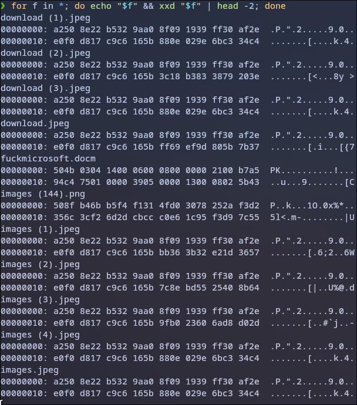

# Chall : saveme
## Categories : Forensics

--- 



First, I checked all given files. None of the image files had valid JPEG or PNG headers, nor did they match any known file signatures. 
Interestingly, most of the image files shared a very similar header prefix (`a250 8e22 b532 9aa0 8f09 1939 ff30 af2e`), which I assume that they were processed using the same transformation rather than being randomly corrupted.

```
❯ tree
.
├── [Content_Types].xml
├── docProps
│   ├── app.xml
│   └── core.xml
├── _rels
└── word
    ├── document.xml
    ├── fontTable.xml
    ├── media
    │   └── image1.jpg
    ├── _rels
    │   └── document.xml.rels
    ├── settings.xml
    ├── styles.xml
    ├── theme
    │   └── theme1.xml
    └── webSettings.xml

7 directories, 11 files
```

After extracting the `.docm` file and inspects it, inside `word/document.xml`, I found an Arabic sentence followed by an unusual string that i tried translating and decrypting it, but did not find any useful information out of it:

```
البوصلة لن تخطئ الطريق، ستضل تشير إلى
Vdcdiycopc
```

And what caught my attention is the large blob of hexadecimal data, which clearly did not resemble normal Word XML content. I extracted this hex data and used [CyberChef](https://cyberchef.io/) to convert it back into raw bytes.

```
❯ file hexpayload.exe 
hexpayload.exe: PE32 executable for MS Windows 4.00 (GUI), Intel i386 (stripped to external PDB), 3 sections
```

The decoded binary started with a valid `MZ` header, confirming that it was a PE executable `.exe`.


