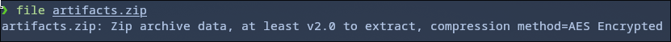
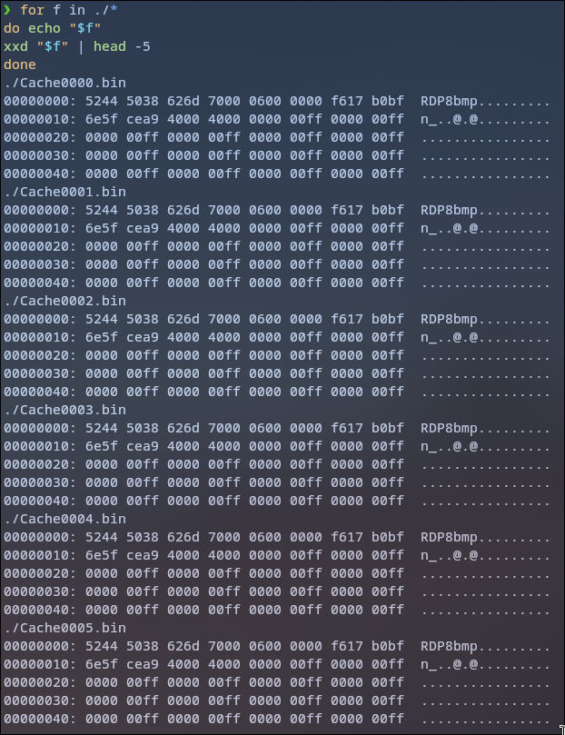
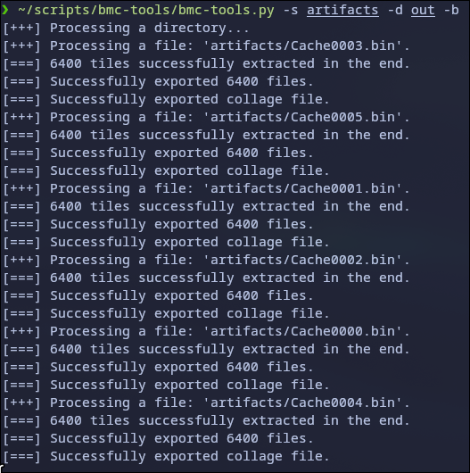
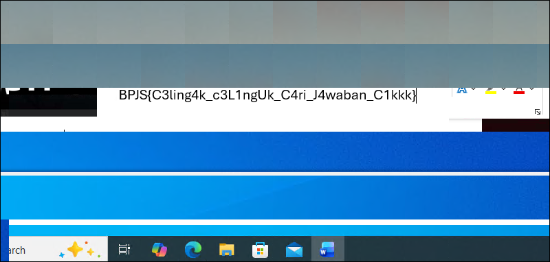

## DISCLAIMER
> I forgot the original name & description of the chall, because i wrote this write up a few weeks after solving it during the competition, so i came up with the name "bin-bmp". 
> I also forgot the password of the original zip file that was given from Healthkathon CTF committee, so in this repo i will only provide the extracted file

---

# Chall: bin-bmp
## Categories: Forensics

---

First, I always check any ctf chall file to check the actual file type, suspecting a file could be a polyglot or something else (and ofc because this is a forensic chall).

```bash
file artifacts.zip
```





After I unzip it, all the extracted file shows a RDP8bmp header, an RDP bitmap cache artifacts which are commonly found in Microsoft Remote Desktop sessions.
I tried opening the files directly, but since they couldn’t be opened as images, I assumed the files were corrupted or incomplete.   

So i used an open-source RDP bitmap cache parser:
([bmc-tools](https://github.com/ANSSI-FR/bmc-tools))



I passed the `-b` argument to generate collage images, since checking thousands of small bitmap tiles one by one would be crazy.

After inspecting the generated images, one of them clearly contained the flag:



